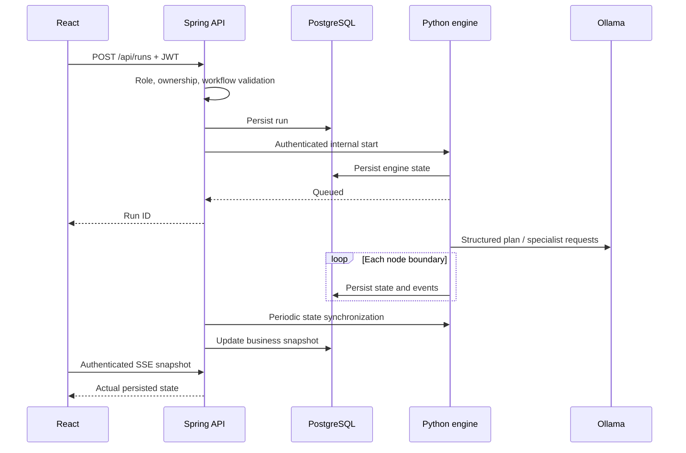
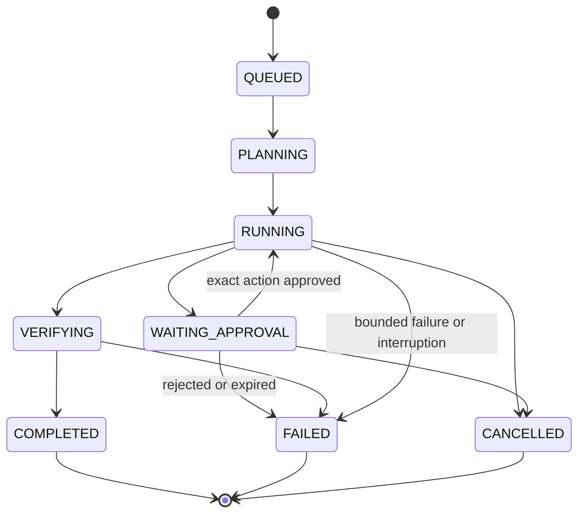

# Architecture

## Service ownership
React only speaks to Spring Boot. The business API owns users, passwords, permissions, project registration, registry configuration, workflow definitions, durable run summaries, and platform audit logs. FastAPI's internal endpoints require a separate service key and are not published by Compose.

The Python engine owns the execution graph, model adapter, tool policy, approval state, task/evidence/event records, and final report. Its `agent_engine.engine_runs` table stores JSON snapshots in a separate PostgreSQL schema, so Java's Flyway migrations can initialize public independently. These are durable execution records, not a fully normalized task/event relational schema.

## Durability and concurrency
PostgreSQL owns durable state; Redis is only a rate limiter. Java uses JPA optimistic locking for run snapshots and reset-token consumption. A pessimistic singleton row serializes workspace reservations, including nested-path overlap checks.

Python admits four runs to two worker threads. Run cancellation is monotonic in the store. Approval decisions are serialized within the single engine process. Process recovery retains pending approvals and fails interrupted runs explicitly. There is no distributed worker lease or automatically replayed mutation.

## Scaling boundary
The current engine must stay single-replica. To distribute it, first add a durable queue, database leases with fencing tokens, action idempotency, normalized event storage, and per-project execution locks. Kubernetes manifests alone would not provide those guarantees.

## Existing code
The initial backend starter, Java version, Spring Boot version, Maven wrapper, and application entry point were retained. The unused Java-side Ollama dependency was removed because inference belongs to Python.

## Run lifecycle

