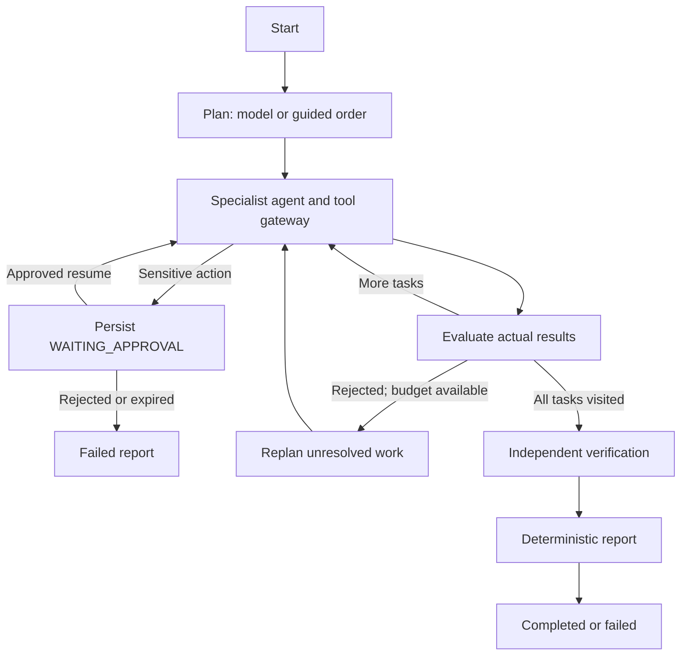

# LangGraph execution

`app/engine.py` builds and compiles an actual `StateGraph`; tests execute that graph. Node state includes run/project IDs, objective, registry snapshots, tasks, cursor, findings, tool results, errors, approval history, events, measured calls, usage metadata, and verification.

Persistence is application-managed at node/tool boundaries through SQLAlchemy. This implementation does not claim to use LangGraph's native checkpoint API. Resume re-enters the agent node using the persisted cursor and approval, while restart recovery refuses to replay interrupted non-waiting work.

Limits: 12 tasks per plan, four specialist iterations per activation, two model attempts per structured call, two replans per run, 36 tool calls, 80 LLM calls, 30 minutes overall, and 1 hour approval lifetime. Network calls have finite timeouts. A timeout cannot preempt a model call instantaneously; the call deadline bounds that delay.

Ollama's grammar compiler rejected large bounded-string schemas on the installed runtime. The generation schema omits unsupported numeric/string bounds and makes fields explicit. Pydantic still validates the full response schema before use.

Cancellation prevents later writes from changing a cancelled run back to completed. Already-running read/model operations may finish before the cancellation check is observed.
