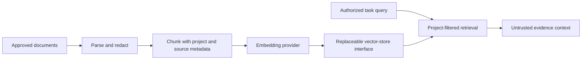

# RAG — deferred design

Vector retrieval is **not implemented**. The current engine uses targeted filesystem tools and bounded evidence. No embedding or retrieval quality claims are made.

Proposed future pipeline:

Implement only after the P0 acceptance gates are reliable. Start with PostgreSQL-backed storage if scale justifies embeddings; do not add a separate vector database merely for the architecture diagram. Retrieval must enforce project ownership before similarity results reach the model.
