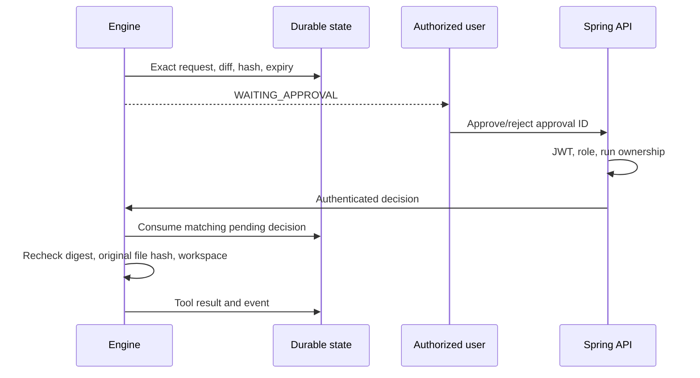

# Security model and boundaries

## Identity and access
Passwords use BCrypt with cost 12. Access JWTs expire after 30 minutes and contain a database-checked token version. Logout, password change, password reset, and administrator status/role changes revoke existing sessions. Forced-reset users can access their profile and password/logout endpoints but cannot operate projects or runs.

| Capability | ADMIN | DEVELOPER | ANALYST | VIEWER |
|---|---|---|---|---|
| Read own projects/runs and shared registries | Yes | Yes | Yes | Yes |
| Register projects / create personal workflows | Yes | Yes | No | No |
| Start read-only runs | Yes | Yes | Yes | No |
| Start edit runs | Yes | Yes | No | No |
| Decide own run approvals | Yes | Yes | Yes | No |
| Manage users, tools, shared templates, agent registry | Yes | No | No | No |
| Read global audit log | Yes | No | No | No |

Administrators may access all projects/runs. Registration never grants administrator rights. The operator controls which directories are placed under the approved workspace root; developer registration reserves a previously unregistered directory. Overlapping project directories are rejected.

Password recovery is administrator-assisted. Forgot-password responses do not disclose account existence. An administrator issues a one-time token for secure out-of-band delivery. Only its SHA-256 digest is stored; it expires after 15 minutes. No email has been sent by this application.

## Approval boundary

Approvals cannot authorize a different request, changed file, different task, or expired action. Rejection fails the run. Gateway allowlists remain in force after approval.

## Untrusted content
Repository text, documentation, comments, model findings, and tool output are data. System prompts separate them from the objective. Independent server policies enforce permissions, paths, risk, and command restrictions even if a model follows an injected instruction. This is defense in depth, not a claim that prompt injection is solved.

Secret-like assignments are redacted, sensitive file names are excluded, and no model reasoning field is recorded. Redaction is heuristic; do not place credentials inside the approved workspace.

## Deployment
Redis rate limits fail closed when Redis is unavailable. HTTP request size limits apply at Nginx and application boundaries. Browser sessions use sessionStorage bearer tokens; TLS and CSP are required for non-local deployment, and XSS remains relevant to bearer storage.

The internal engine uses a separate shared service key and is not published in Compose. Rotate JWT/service keys operationally. PostgreSQL and Redis have no host ports by default.

This is a single-engine portfolio platform, not hardened hostile multi-tenancy. Remaining work includes distributed locks, per-project concurrent-edit isolation, comprehensive dependency scanning, refresh-token rotation, security event monitoring, and production mail delivery.
