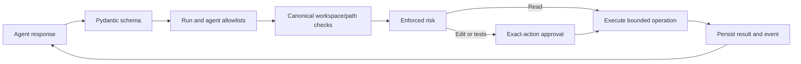

# Tool gateway

| Tool | Behavior | Risk |
|---|---|---|
| list_files / inspect_project | Filtered inventory, maximum 500 source/document files | LOW |
| read_file | At most 100 KB source file; returned text bounded and redacted | LOW |
| search_code | Literal case-insensitive search, maximum 80 matches | LOW |
| inspect_dependencies | Manifest evidence; no CVE claim | LOW |
| security_scan | Heuristic patterns; never automatically a vulnerability finding | LOW |
| inspect_git_diff | Git diff with external diff, text conversion and fsmonitor disabled | LOW |
| modify_file | Existing file only; optimistic content hash and atomic replacement | MEDIUM |
| run_tests | Fixed Python unittest command in a constrained Docker container | HIGH |

run_tests is deliberately HIGH: tests execute repository code even if the command name looks harmless. Every test execution and mutation requires approval. Risk metadata cannot downgrade gateway enforcement.

Paths reject absolute paths, traversal, drive prefixes, links/junctions, sensitive names, and excluded build/dependency directories. File suffixes are allowlisted. Workspace roots are configured by the operator; project paths are registered under that root.

The optional test sandbox copies allowlisted files to a temporary snapshot. It does not mount .env or Git metadata. The container is network-disabled, read-only, non-root, capability-dropped, and limited to one CPU, 256 MB, 64 processes, and 60 seconds. It has a small temporary filesystem. The default Compose engine has no Docker socket, so this runner fails closed unless the host-engine sandbox is explicitly configured.

No arbitrary shell, dependency installation, deletion, commit, push, or reset tool exists. Maven/npm test adapters, build tools, create_file, rollback, external documentation search, and automatic test generation are not implemented.

Host-side file operations assume the approved workspace is not being adversarially renamed during an operation. Strong multi-tenant execution requires filesystem isolation beyond path checks.
